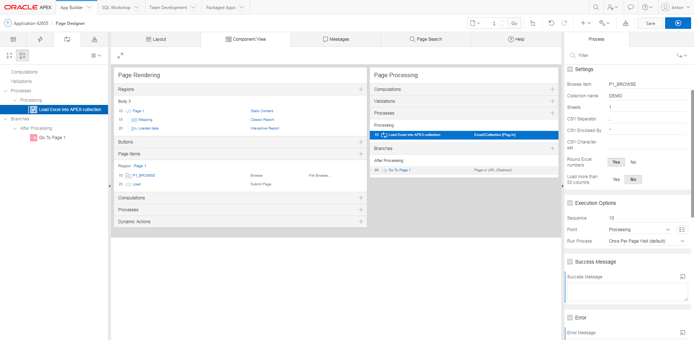

# excel2collections
Oracle APEX process type plugin to load an Excel file into an APEX collection
## Usage
- Just import the plugin into a application
- and on a page with a File Browse item
- add the plugin to the "processing" section a your
- As soon as you submit your page the Excel is loaded to a APEX collection

- Or take a look at the included [demo application](demo/f107_demo_application.sql)

If you like this plugin: [donations](https://www.paypal.me/apexplugins/3) are most appreciated :yum:.

People which make a [large donation](https://www.paypal.me/apexplugins/10) (and leave their email-adress) are rewarded: I will send them a script which creates a database package and some types. The excel2collection plugin (as of version 0.904) will detect the package and use it. And now it will load a lot more records (at apex.oracle.com it will load more than 10000 records) before APEX throws a ORA-00040: active time limit exceeded - call aborted 
